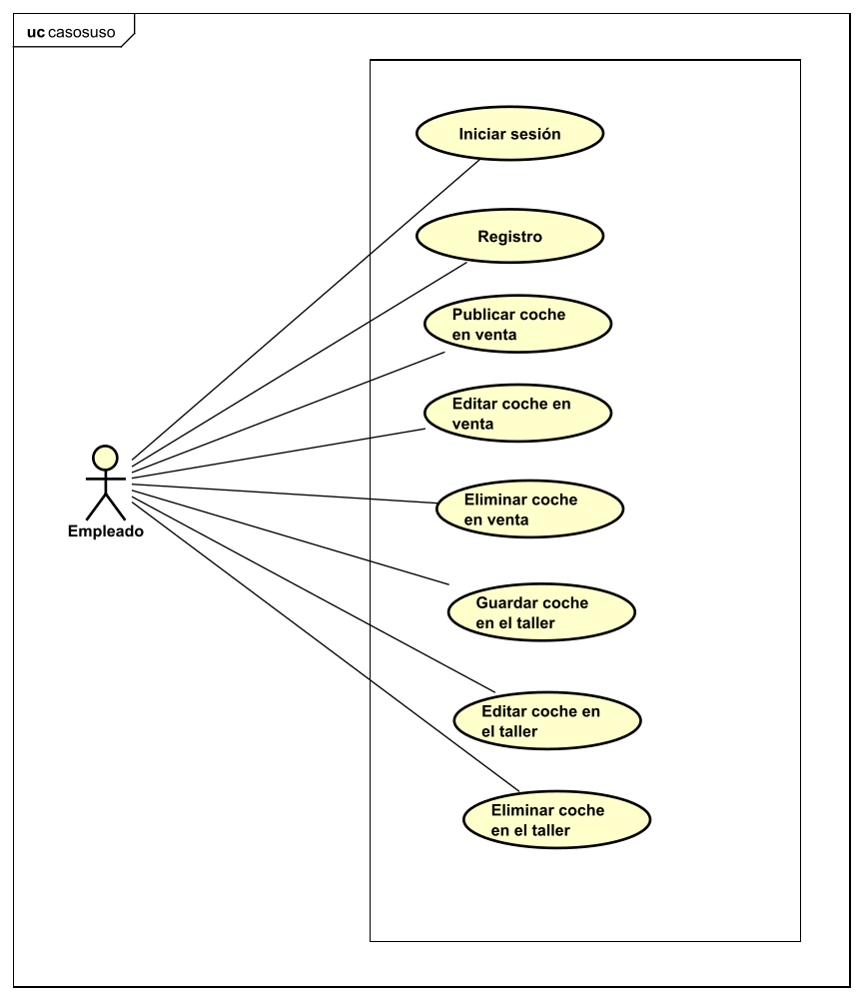
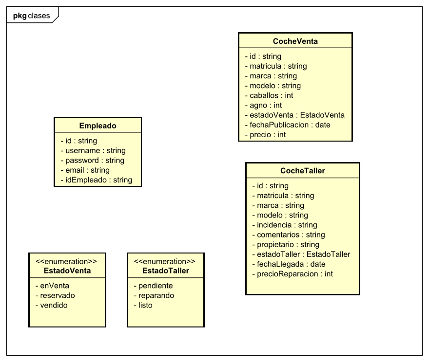
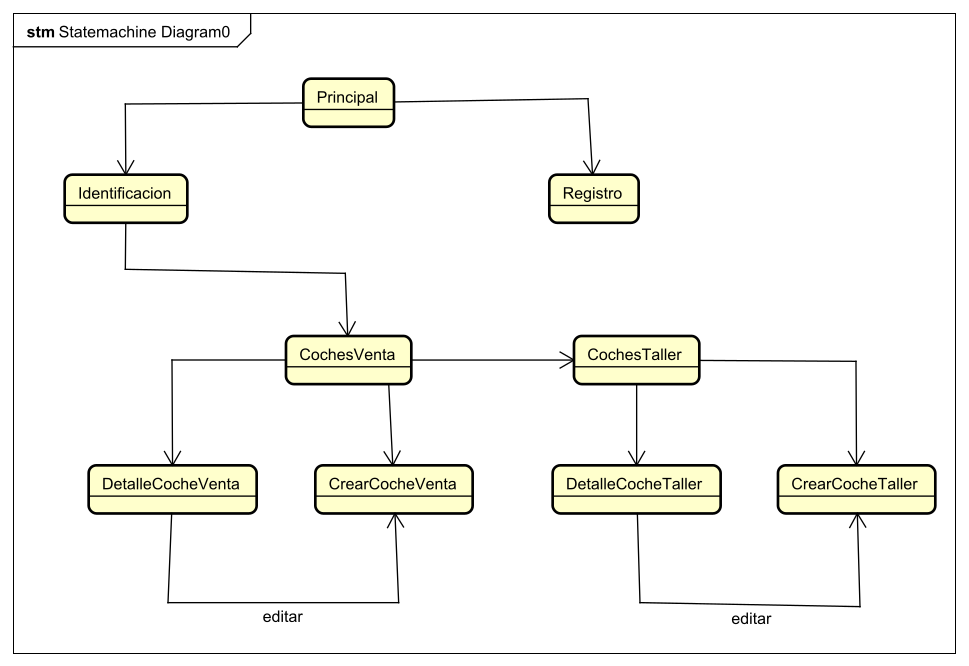
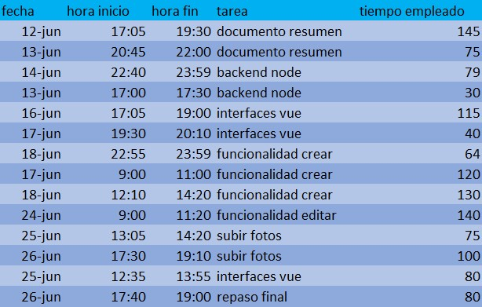

<h1>Documento resumen del proyecto para crear la aplicación "HyperCars"</h1>

<ol>
<h2><li>Resumen del proyecto</li></h2>

Esta aplicación permitirá la gestión de los coches de un concesionario, tanto los coches en venta como los coches en el taller. Para ello, los empleados identificados podrán añadir coches en venta definiendo los datos sobre este como su marca, modelo, año o precio. Además podrán editar estos datos o eliminar los coches en venta. Lo mismo sucede para los coches en el taller, podrá añadir un coche al taller definiendo en este caso también su marca y modelo pero otros datos específicos como su propietario e incidencia. También podrán modificar estos datos y eliminar coches del taller.

<h2><li>Aplicaciones similares</li></h2>

Se han encontrado diferentes páginas de concesionarios de coches que se pueden utiliar como referencia:

<ol>
  <li>http://www.jmautomocion.com/index.html</li>
  <li>https://www.iconicmotor.net/</li>

</ol>

<h2><li>Tecnologías utilizadas</li></h2>

Se van a utilizar las siguientes tecnologías:

<ul>
<li>Frontend: Vue y Bootstrap</li>
<li>Backend: NodeJS y ExpressJS</li>
<li>Base de datos: MongoDB</li>
</ul>

<h2><li>Funcionalidad de la aplicación. Casos de uso</li></h2>

A continuación se expone el diagrama de casos de uso de la aplicación:

<h2><li>Diagrama de clases</li></h2>

A continuacion se expone el diagrama de clases de la aplicación:

<h2><li>Estructura de la base de datos</li></h2>

La estructura de la base de datos se basa en el el diagrama de clases anterior.

<h2><li>Estructura del backend</li></h2>

En el backend se encuentra una carpeta con unos archivos que contienen las clases del diagrama de clases definido. En otra carpeta se encuentra un archivo que gestiona las peticiones del frontend. Para ello, se definen las diferentes rutas mediante ExpressJs a las que el frontend puede mandar las peticiones. Para cada ruta se realiza una operación sobre la base de datos.

<h2><li>Estructura del frontend</li></h2>
La aplicación contará con las siguientes vistas:
<ul>
<li>PantallaPrincipal: esta vista funcionará como una landing page.</li>
<li>Identificación: esta vista contará con un formulario para que el empleado se identifique.</li>
<li>Registro: esta vista contará con un formulario para que el empleado se registre. </li>
<li>CochesVenta: esta vista mostrará los coches en venta que tenga el concesionario.</li>
<li>CochesTaller: esta vista mostrará los coches en el taller que tenga el concesionario.</li>
<li>DetalleCocheVenta: esta vista mostrará los detalles de un coche en venta.</li>
<li>DetalleCocheTaller: esta vista mostrará los detalles de un coche en el taller.</li>
<li>CrearCocheVenta: esta vista permitirá crear un coche en venta introduciendo sus detalles. También servirá para editar los datos de un coche en venta, para ello en el formulario cargará los datos del coche.</li>
<li>CrearCocheTaller: esta vista permitirá crear un coche en el taller introduciendo sus detalles. También servirá para editar los datos de un coche en el taller, para ello en el formulario cargará los datos del coche.</li>

</ul>

La navegación entre las diferentes vistas en la siguiente:

<h2><li>Bocetos del frontend</li></h2>
Se han realizado bocetos con Figma con la idea básica de como será la aplicación. Estos bocetos han servido de guía para el desarrollo de la aplicación, sin embargo durante el desarrollo se han encontrado mejoras sobre estos bocetos. Por lo tanto el resultado final, combina los bocetos con ideas aparecidas durante el desarrollo. Los bocetos se encuentran en el pdf adjunto bocetos-hypercars.

<h2><li>Detalles de la aplicacion</li></h2>
<ul>

<li>Colores:
<ul>
<li>Azul oscuro:#020045</li>
<li>Blanco:#FFFFFF</li>
</ul>
</li>
<li>Icono:</li>

</ul>
<h2><li>Registro del tiempo</li></h2>

A continuación se detalla el tiempo utilizado para el proyecto: 

<strong>Tiempo empleado: 1275 minutos (21 horas y 15 minutos)</strong>

<h2><li>Resultado final: vídeo youtube y repositorio</li></h2>
Repositorio Github:

<h2><li>Conclusiones</li></h2>
He aprendido los pilares básicos sobre Vue y como realizar las principales acciones con este framework. He aprendido a comunicar este framework con el backend y a como mostrar los datos obtenidos.

</ol>